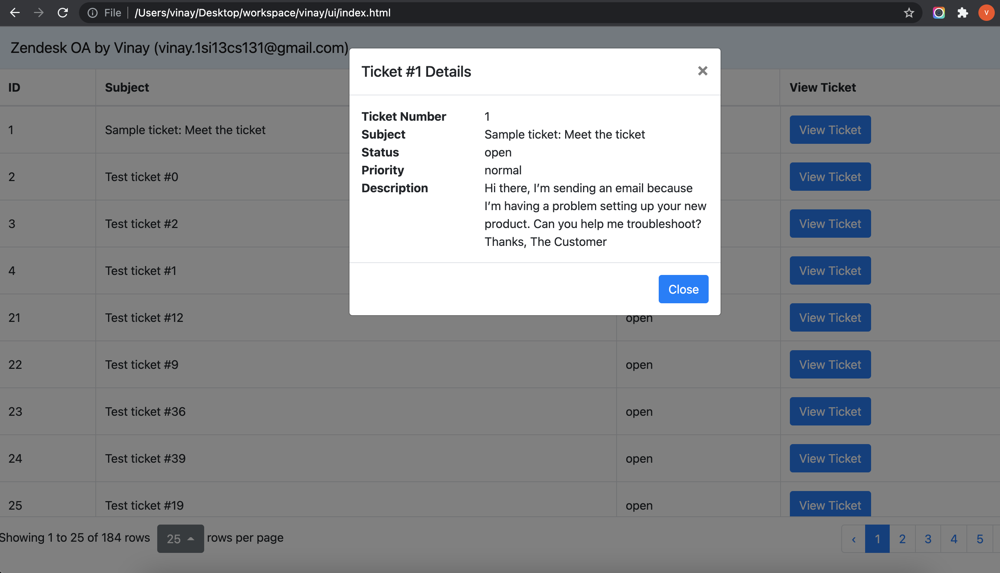

# Zendesk OA - Vinay (vinay.1si13cs131@gmail.com)

1. [Features. ](#feats)
2. [System Requirements. ](#reqs)
3. [Instructions to run application. ](#runapp)
4. [Sequence diagram](#seq_diagram)
5. [High level component design](#high_design)
6. [Implementation details. ](#implementation)
7. [Technology stack. ](#stack)
8. [Unit test results](#junits)
9. [Screenshots](#screenshots)

<a name="feats"></a>
## Features
    - User can view list of assigned tickets on browser.
    - User can paginate across tickets if number of tickets are more than 25.
    - User can click on each ticket to view details.
    - Default tickets per page is set to 25. But user can change it if required.
    - Appropriate error messages are displayed on UI in case of exceptions.

<a name="reqs"></a>
## System requirements
    - Java 8 - To run spring boot application.
    - Maven - To build application.
    - Chrome - To run UI.

<a name="runapp"></a>
## Instructions to run application
### Instuctions to run backend
```sh
cd backend
mvn clean install
java -jar target/vinay-0.0.1-SNAPSHOT.jar
```
### Instuctions to run UI
    - Go to ui directory open index.html on Chrome browser

<a name="seq_diagram"></a>
## Sequence diagram


<a name="high_design"></a>
## High level component design


<a name="implementation"></a>
## Implementation details
1. Using spring boot for rapid development of backend microservice within short duration.
2. Used spring webclient for communication between microservice and Zendesk API.
3. For authorization with Zendesk, I'm using OAuth token. Zendesk URL and API token are stored as environment variables.
4. zendesk-java-client(by cloudbees-oss) is not used since this library is not officially  supported from Zendesk.
4. Created 2 API for getting ticket list and individual ticket details.
5. Used ehcache to store results for 600 seconds.
6. Junit tests are written for both rest layer and service layer. Model and configs are ingored as of now.
7. For displaying ticket list in UI I'm using simple and light weight bootstrap table. This table is paginated and user can change number of records per table.
8. Individual ticket details are displayed as modal popup. Currently limited fields are displayed in UI, if required they can be changed without additional efforts.
9. Screenshots of UI and test coverage are attached at the bottom.

<a name="stack"></a>
## Technology stack
    - Languages: Java 8, Javascript, HTML/CSS
    - Frameworks: Springboot, ehcache
    - UI: Bootstrap table

<a name="junits"></a>
## Unit test results


<a name="screenshots"></a>
## Screenshots
- Successful loading

- View ticket details

- Select number of tickets per page

- Error while loading main page

- Error while loading ticket details
